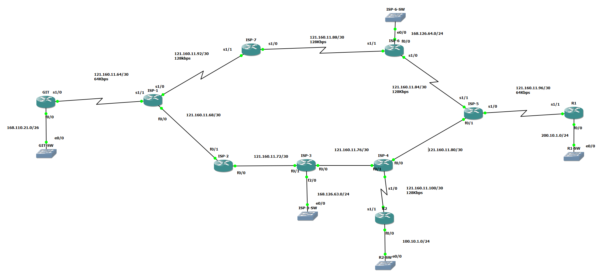

# 🌐 EIGRP Multi-ISP Network Lab (Cisco IOS / GNS3)

<div align="center">


**EIGRP AS 100 Multi-ISP 백본 구성 + Route Summarization 종합 실습 (Cisco IOS / GNS3)**

</div>

---

## 📌 프로젝트 개요

GNS3 / Cisco IOS 환경에서 **7개의 ISP 백본 라우터**와 **3개의 고객사 라우터(GIT, R1, R2)** 를 EIGRP(AS 100)로 연동하고, Manual Route Summarization을 통해 라우팅 테이블을 최적화하는 종합 실습 프로젝트입니다.

| 항목 | 내용 |
| --- | --- |
| 라우팅 프로토콜 | EIGRP (AS 100) |
| 라우터 수 | 10대 (ISP 7대 + 고객사 GIT / R1 / R2) |
| 핵심 기술 | VLSM, Manual Route Summarization, Passive Interface, Loopback 광고, DUAL 알고리즘 |
| 시뮬레이터 | GNS3 (Cisco IOS c3745) |

---

## 🗺️ 네트워크 토폴로지



### 구성 요소

- **ISP 백본 (AS 100)**: ISP-1 ~ ISP-7 (총 7대) — 링 형태 다중 경로 redundancy
- **고객사 라우터**: GIT (↔ ISP-1), R1 (↔ ISP-5), R2 (↔ ISP-4)
- **WAN 구간 (HDLC)**: 64 Kbps / 128 Kbps (DCE 측 `clock rate` 설정)
- **LAN 구간 (FastEthernet)**: GIT-SW, ISP-3-SW, ISP-6-SW, R1-SW, R2-SW

### 회선 / 인터페이스 구성

- **WAN 구간 (HDLC, /30)**:
  - `121.160.11.64/30` (GIT ↔ ISP-1) — 64 Kbps
  - `121.160.11.84/30` (ISP-5 ↔ ISP-6) — 128 Kbps
  - `121.160.11.88/30` (ISP-6 ↔ ISP-7) — 128 Kbps
  - `121.160.11.92/30` (ISP-1 ↔ ISP-7) — 128 Kbps
  - `121.160.11.96/30` (ISP-5 ↔ R1) — **64 Kbps**
  - `121.160.11.100/30` (ISP-4 ↔ R2) — 128 Kbps
- **LAN 구간 (FastEthernet)**:
  - `168.110.21.0/26` (GIT ↔ GIT-SW)
  - `168.126.63.0/24` (ISP-3 ↔ ISP-3-SW)
  - `168.126.64.0/24` (ISP-6 ↔ ISP-6-SW)
  - `200.10.1.0/24` (R1 ↔ R1-SW)
  - `100.10.1.0/24` (R2 ↔ R2-SW)
- **Loopback 광고 대역**:
  - 라우터 식별 — GIT `123.123.123.123/24`, R1 `11.11.11.11/24`, R2 `22.22.22.22/24`, ISP-X `101.101.10X.X/24`
  - 요약 대상 — ISP-2/3/4/6의 Loopback 1·2 (`131.116.0.0 ~ 131.116.7.0/24`)

### 핵심 포인트

- **GIT, R1**은 ISP-1과 ISP-5 방향에서 `131.116.0.0/21`로 **요약된 단일 경로**만 수신
- **ISP-1 (s1/1)** 과 **ISP-5 (s1/0)** 가 **Summarizer 역할** 수행 → AD 5의 요약 경로 생성
- ISP 백본 링 구성으로 **DUAL의 Feasible Successor**가 자연스럽게 형성됨
- `R1 ↔ ISP-5` 구간은 **64 Kbps**로 가장 저속 → EIGRP Metric(Bandwidth) 결정에 영향

---

## 📁 프로젝트 구조

```
EIGRP-Multi-ISP-Network/
├── docs/                              # EIGRP 이론 정리
│   ├── 01-eigrp-theory.md             # EIGRP 개요, AD/Metric, K-상수
│   ├── 02-eigrp-pdu.md                # 5가지 PDU (Hello/Update/Query/Reply/Ack)
│   └── 03-dual-algorithm.md           # DUAL (Successor, FD/AD)
├── preconfig/                         # 단계별 실습 사전 설정
│   ├── 01-router-ip-preconfig.txt
│   ├── 02-loopback0-preconfig.txt
│   ├── 03-loopback1-2-preconfig.txt
│   ├── 04-eigrp-routing-preconfig.txt
│   └── 05-eigrp-ip-summary-preconfig.txt
├── connection-check/                  # 검증 명령어 / 실제 결과
│   ├── verification-commands.md
│   └── verification-command-preconfig.txt
├── topology/
│   └── eigrp_isp_topology.png
├── LICENSE
└── README.md
```

### 학습 순서

1. 📘 **이론 학습** → [`docs/`](./docs/) 폴더의 문서를 순서대로 읽기
2. 🛠️ **실습 진행** → [`preconfig/`](./preconfig/) 폴더의 설정 파일을 번호순으로 입력
3. 🔍 **결과 검증** → [`connection-check/verification-commands.md`](./connection-check/verification-commands.md) 명령어로 확인

---

## 📚 EIGRP 핵심 이론 요약 (docs/)

자세한 내용은 `docs/` 폴더를 참고하세요.

| 문서 | 내용 |
| --- | --- |
| [01. EIGRP 이론](./docs/01-eigrp-theory.md) | Distance Vector + Link-State 하이브리드, AS, AD, Metric, K-상수, Load Balancing |
| [02. EIGRP 5가지 PDU](./docs/02-eigrp-pdu.md) | Hello, Update, Query, Reply, Ack 동작 원리 |
| [03. DUAL 알고리즘](./docs/03-dual-algorithm.md) | Successor, Feasible Successor, FD/AD 계산 및 DUAL 조건 |

---

## 💡 학습 포인트

- **EIGRP 하이브리드 동작**: Distance Vector 기반이지만 Link-State처럼 Topology Table 유지 → 빠른 수렴
- **Passive-interface default**: 기본 차단 후 필요한 인터페이스만 `no passive-interface`로 활성화
- **VLSM + Classless**: `/24`, `/30` 혼용 설계, `no auto-summary` 필수
- **Manual Route Summarization**: 인터페이스 단위 `ip summary-address eigrp` 적용 → AD 5의 요약 경로 생성
- **DUAL의 Feasible Successor**: 장애 발생 시 SPF 재계산 없이 즉시 백업 경로로 전환
- **Loopback 광고**: 라우터 식별 Loopback도 `network` 명령으로 EIGRP 도메인에 포함

---

## 🎯 실습 목표

| # | 실습 내용 | Preconfig 파일 |
| :---: | --- | --- |
| **EX1** | 라우터 기본 설정 (Hostname / `no ip domain-lookup`) 및 LAN(FastEthernet) · WAN(HDLC) IP 할당, Next-hop 구간 통신 확인 | [`01-router-ip-preconfig.txt`](./preconfig/01-router-ip-preconfig.txt) |
| **EX2** | 각 라우터 **Loopback 0** 생성 — GIT `123.123.123.123/24`, R1 `11.11.11.11/24`, R2 `22.22.22.22/24`, ISP-X `101.101.10X.X/24` | [`02-loopback0-preconfig.txt`](./preconfig/02-loopback0-preconfig.txt) |
| **EX3** | ISP-2/3/4/6 라우터에 **Loopback 1, 2** 추가 (`131.116.X.0/24` 가상 네트워크) — Route Summarization 대상망 | [`03-loopback1-2-preconfig.txt`](./preconfig/03-loopback1-2-preconfig.txt) |
| **EX4** | **EIGRP AS 100** 라우팅 구성 (`no auto-summary`, `passive-interface default` + 필요 인터페이스만 활성, Loopback 0/1/2 포함) | [`04-eigrp-routing-preconfig.txt`](./preconfig/04-eigrp-routing-preconfig.txt) |
| **EX5** | ISP-1(`s1/1`) · ISP-5(`s1/0`)에서 **Manual Route Summarization** 적용 → GIT/R1에서 `131.116.0.0/21` 단일 경로 확인 | [`05-eigrp-ip-summary-preconfig.txt`](./preconfig/05-eigrp-ip-summary-preconfig.txt) |
| **EX6** | Neighbor / Topology / Routing Table 검증 및 DUAL(Successor·FS, FD/AD) 분석, Ping·Traceroute 통신 확인 | [`verification-commands.md`](./connection-check/verification-commands.md) |

---

### 🔑 EIGRP 핵심 요약

#### EIGRP 특성

- **Cisco 전용 Routing Protocol** (1986년 IGRP 확장형, 2013년 RFC 7868로 공개)
- **Distance Vector 기반이지만 Link-State처럼 동작** (하이브리드 / Advanced DV)
- **Classless**: SubnetMask 포함, VLSM/CIDR 지원
- **Protocol 번호 88번** 사용
- **Multicast 주소**: `224.0.0.10` (All EIGRP Routers)

#### AD (Administrative Distance)

| Protocol | AD 값 | 비고 |
|----------|:---:|------|
| Connected | 0 | |
| Static | 1 | |
| **EIGRP Summary** | **5** | **요약 경로 (가장 신뢰 높음)** |
| **EIGRP Internal** | **90** | Bandwidth + Delay |
| OSPF | 110 | Bandwidth 기반 Cost |
| RIP | 120 | Hop-count |
| **EIGRP External** | **170** | 재분배 경로 |

#### EIGRP Metric 공식

```
EIGRP Metric    = EIGRP Bandwidth + EIGRP Delay
EIGRP Bandwidth = (10^7 / 목적지까지 최소 Bandwidth) × 256
EIGRP Delay     = (목적지까지 Delay의 총 합 / 10) × 256
```

> **K-상수 기본값**: K1=1, K2=0, K3=1, K4=0, K5=0 → **Bandwidth + Delay만 사용**

#### EIGRP 5가지 PDU

| PDU | 역할 |
|-----|------|
| **Hello** | Neighbor 발견 및 인접관계 유지 (5초 주기, Hold time 15초) |
| **Update** | 라우팅 정보 광고 (Reliable, RTP 사용) |
| **Query** | Successor 손실 시 대체 경로 문의 |
| **Reply** | Query에 대한 응답 |
| **Ack** | Update / Query / Reply 수신 확인 |

#### EIGRP Neighbor 형성 흐름

```
Down → Pending → Up (Hello 교환 → Update 동기화 → Topology Table 동기)
```

#### EIGRP 3가지 Table

| Table | 역할 |
|-------|------|
| **Neighbor Table** | EIGRP 인접 라우터 목록 (Hello로 유지) |
| **Topology Table** | 모든 학습 경로 + DUAL 계산용 메타데이터 |
| **Routing Table** | 최적 경로(Successor)만 등록 |

#### DUAL 알고리즘 핵심

- **FD (Feasible Distance)**: 자신 → 목적지까지의 **총 비용** → Routing Table 등록값
- **AD / RD (Advertised Distance)**: Next-hop **라우터 → 목적지**까지의 비용
- **Successor**: 가장 작은 FD를 가진 **최적 경로**
- **Feasible Successor (FS)**: `이웃의 AD < 현재 Successor의 FD` 조건을 만족하는 **사전 백업 경로**
- → 장애 시 Query 없이 즉시 FS로 전환 (Sub-second convergence)

  #### IP 추가 명령어 작성 예시

```
en
conf t
!--- 호스트이름 변경 ---
hostname GIT
!--- 명령어 잘못 입력시 DNS서버 찾기 금지 ---
no ip domain-lookup
!--- IP 주소 추가 ---
interface fa0/0
 description To GIT-SW
 ip address 168.110.21.62 255.255.255.192
 no shutdown
!
end
wr
!
```

#### ROUTING 명령어 작성 예시

```
en
conf t
!
! ===== EIGRP 라우팅 설정 =====
router eigrp 100
 !
 ! --- 자동 요약 끄기 (VLSM 환경 필수) ---
 no auto-summary
 !
 ! --- 최적화를 위해 모든 인터페이스 차단 후 필요한 것만 활성화 ---
 passive-interface default
 !
 ! --- WAN / LAN 구간 인터페이스만 광고 활성화 ---
 no passive-interface s1/0
 no passive-interface s1/1
 no passive-interface fa0/0
 !
 ! --- 네트워크 추가 (네트워크 주소 + 와일드카드 마스크) ---
 network 121.160.11.64 0.0.0.3
 network 121.160.11.68 0.0.0.3
 network 121.160.11.92 0.0.0.3
 network 101.101.101.0 0.0.0.255
!
end
wr
!
```

---

## ✅ 검증 결과

### 📍 GIT 라우터 — `131.116.0.0/21` 요약 경로 학습 확인

```
GIT# show ip route eigrp
     131.116.0.0/21 is subnetted, 1 subnets
D       131.116.0.0 [90/40665600] via 121.160.11.66, 00:00:14, Serial1/0    ← 단일 요약 경로 ✓
```

### 📍 R1 라우터 — `131.116.0.0/21` 요약 경로 학습 확인

```
R1# show ip route eigrp
     131.116.0.0/21 is subnetted, 1 subnets
D       131.116.0.0 [90/40665600] via 121.160.11.97, 00:01:33, Serial1/1    ← 단일 요약 경로 ✓
```

### 📍 ISP-1 — Neighbor 정상 형성 (3-way 인접)

```
ISP-1# show ip eigrp neighbors
IP-EIGRP neighbors for process 100
H   Address          Interface     Hold Uptime   SRTT   RTO  Q   Seq
                                   (sec)         (ms)        Cnt Num
2   121.160.11.94    Se1/0          11  00:01:27   27  1140   0   39    ← ISP-7
1   121.160.11.65    Se1/1           9  00:01:30   51  2280   0   26    ← GIT
0   121.160.11.70    Fa0/0          14  00:01:34   54   324   0   58    ← ISP-2
```

### 📍 ISP-1 — Route Summarization 설정 확인

```
ISP-1# show ip protocols
Routing Protocol is "eigrp 100"
  Automatic network summarization is not in effect                  ← no auto-summary ✓
  Address Summarization:
    131.116.0.0/21 for Serial1/1                                     ← Manual 요약 ✓
      Summarizing with metric 409600
  Routing for Networks:
    101.101.101.0/24
    121.160.11.64/30
    121.160.11.68/30
    121.160.11.92/30
  Passive Interface(s):                                              ← passive default ✓
    FastEthernet0/1
    Serial1/2
```

### 📍 총 10대 라우터에서 EIGRP 인접 관계 형성 완료

📝 **상세 검증 자료**:
- [🔍 검증 명령어 가이드](./connection-check/verification-commands.md)
- [📁 단계별 사전 설정](./preconfig/)

---

## 🔍 주요 검증 명령어

```
show ip interface brief             # 인터페이스 상태
show ip eigrp neighbors             # EIGRP Neighbor 상태
show ip eigrp interfaces            # EIGRP 활성 인터페이스
show ip eigrp topology              # Topology Table (Successor / FS)
show ip eigrp topology all-links    # 모든 경로 (FS 후보 포함)
show ip route eigrp                 # EIGRP 학습 경로 (D / D EX)
show ip route                       # 전체 라우팅 테이블
show ip protocols                   # EIGRP AS, K값, 요약, Passive 확인
show ip eigrp traffic               # EIGRP PDU 송수신 통계
debug eigrp packets                 # EIGRP 패킷 디버그
debug eigrp fsm                     # DUAL 상태 머신 디버그
```

---

## 💡 배운 점

- **EIGRP 하이브리드 동작 원리 이해**: Distance Vector의 단순함과 Link-State의 빠른 수렴을 결합한 설계 철학 학습
- **Passive Interface Default 전략의 효율성**: 기본 차단 후 필요한 인터페이스만 활성화하여 불필요한 Hello 패킷·CPU 부하 최소화
- **Manual Route Summarization의 효과**: 8개의 `/24` 네트워크를 단일 `/21`로 통합 → 라우팅 테이블 크기 감소, SPF/DUAL 계산 부하 절감, 장애 범위 격리
- **VLSM 설계 능력 향상**: `/30` (WAN), `/24` (LAN), `/26` (LAN 일부) 혼용을 통한 IP 자원 효율화
- **DUAL 알고리즘의 Sub-second Convergence**: Feasible Successor 사전 선출로 Query 없이 즉시 전환 → OSPF 대비 수렴 속도 우위
- **ISP 백본 redundancy의 중요성**: 링 형태 다중 경로로 단일 링크 장애 시에도 통신 단절 방지
- **EIGRP Metric의 Bandwidth 민감성**: 64 Kbps 구간이 경로 선택에 결정적 영향 → 회선 설계 시 일관된 대역폭 정책 필요
- **EIGRP PDU별 동작 원리** 이해를 통한 트러블슈팅 능력 향상 (특히 Stuck-in-Active 상황 대응)

---

## 🛠️ 사용 도구

| 도구 | 용도 |
|------|------|
| **GNS3** | 네트워크 시뮬레이터 |
| **Cisco IOS (c3745)** | 라우터 운영체제 |
| **Cisco CLI** | 라우터 설정 명령어 입력 |
| **MobaXterm** | 콘솔 접속 터미널 |
| **Git / GitHub** | 형상 관리 및 포트폴리오 |

---

## 📄 License

[MIT License](./LICENSE)

<div align="center">

**작성자**: [KSNAM97](https://github.com/KSNAM97)  
**작성일**: 2026.06  
**프로젝트 유형**: 네트워크 엔지니어링 포트폴리오

</div>
