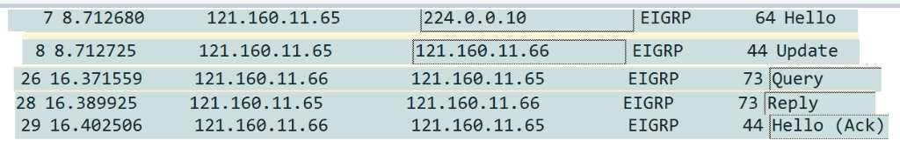

# EIGRP 5가지 PDU (Protocol Data Unit)

EIGRP는 5가지 패킷을 사용한다: **Hello, Update, Query, Reply, Ack**

## 1️⃣ Hello

### 역할
- Hello Packet 송/수신 후 **인접성 조건 비교**
- 인접성 조건 일치 시 **인접성 형성 및 유지**
- 주기적인 교환으로 인접성 유지

### EIGRP 인접성 조건 (3가지)

1. **AS번호** (1~65535)
2. **K상수** (Default: K1=1, K3=1)
3. **Authentication** (설정 시 동일 값 필요)

### Neighbor Table 등록
인접성 조건이 동일하면 **Neighbor Table에 등록**된다.
```
show ip eigrp neighbor
```

### Hello-Interval / Hold-time

| 구간 | Hello-Interval | Hold-time |
|------|---------------|-----------|
| LAN (Ethernet, FastEthernet) | 5초 | 15초 |
| WAN (PPP, HDLC, F/R P2P) | 5초 | 15초 |
| WAN (F/R Multipoint, NBMA) | 60초 | 180초 |

> **Hold-time = Hello-Interval × 3** (Hello 미수신 시 인접성 단절)

### IP 주소 사용
- **출발지**: 송신 Interface IP
- **목적지**: Multicast (**224.0.0.10**) 만 사용

---

## 2️⃣ Update

### 역할
- Hello 교환 후 인접성이 연결되면 Neighbor Table에 등록
- **Neighbor Table에 등록된 Router 간 라우팅 업데이트 실시**

### 동작 흐름
```
1. Hello 교환 → 인접성 조건 일치 → Neighbor Table 등록
2. Neighbor Router 간 라우팅 업데이트 실시
3. 모든 네트워크 정보 + 경로 정보 → Topology Table 등록
4. Topology Table에서 최적 경로 선출 → Routing Table 등록
```

### EIGRP 3가지 Table

| Table | 역할 |
|-------|------|
| **Neighbor Table** | EIGRP 인접성 목록 |
| **Topology Table** | 모든 네트워크 정보 + 통신 가능한 모든 경로 |
| **Routing Table** | Topology Table에서 최적 경로만 선출 등록 |

### IP 주소 사용
- **출발지**: 송신 Interface IP
- **목적지**: 네트워크 환경에 따라 다름
  - Ethernet (Broadcast Multi-Access): **Multicast (224.0.0.10)**
  - HDLC, PPP, Frame-relay: **Unicast**

---

## 3️⃣ Query

### 역할
- Routing Table 경로 Down + Topology Table에 **Feasible Successor 없을 때**
- 또는 자신의 Topology에 없는 네트워크 정보 요청받을 때
- **자신에게 존재하지 않는 네트워크 정보를 Neighbor에게 질의**

### 용어 정의
- **Successor**: 최적 경로
- **Feasible Successor**: 최적 경로 장애 시 사용되는 **후속 경로 (대체 경로)**

### Query 확산 중지 조건
- Neighbor가 없을 때까지
- 또는 대체 경로 존재 시 중지

### IP 주소 사용
- **출발지**: 송신 Interface IP
- **목적지**: 환경별
  - Ethernet (Broadcast Multi-Access): **Multicast (224.0.0.10)**
  - PPP, HDLC, Frame-relay: **Unicast**

---

## 4️⃣ Reply

### 역할
- **Query에 대한 응답 Packet**
- 대체 경로의 유/무 확인
- Query 수신 시 대체 경로가 없으면 다른 Neighbor에게 Query 전송
- 마지막 EIGRP Router(전송할 Neighbor 없음)는 Reply로 대체 경로 유/무 확인

### IP 주소 사용
- **출발지**: 송신 Interface IP
- **목적지**: **Unicast만 사용**

---

## 5️⃣ Ack (Acknowledgement)

### 역할
- **Update, Query, Reply에 대한 응답 Packet**
- 데이터 수신 확인

### 재전송 메커니즘
- Update/Query/Reply 송신 후 Ack 미수신 시 **최대 16회 재송신**
- 16회 후에도 Ack 미수신 → **Neighbor Table에서 인접성 삭제**

### IP 주소 사용
- **출발지**: 송신 Interface IP
- **목적지**: **Unicast만 사용**

---

## 📊 PDU별 IP 주소 사용 요약

| PDU | 출발지 IP | 목적지 IP |
|-----|----------|----------|
| Hello | 송신 Interface IP | **Multicast (224.0.0.10)** |
| Update | 송신 Interface IP | Multicast / Unicast (환경별) |
| Query | 송신 Interface IP | Multicast / Unicast (환경별) |
| Reply | 송신 Interface IP | **Unicast만** |
| Ack | 송신 Interface IP | **Unicast만** |

### EIGRP 5가지 PDU 캡처 예시

Wireshark 캡처 결과, `121.160.11.65`에서 `224.0.0.10`으로 Hello 패킷이 전송되었고, `121.160.11.65`와 `121.160.11.66` 사이에서 Update, Query, Reply, Ack 패킷이 교환되는 것을 확인하였다.
특히 Ack는 Wireshark에서 `Hello (Ack)` 형태로 표시되며, 본 캡처를 통해 EIGRP의 5가지 PDU를 모두 식별할 수 있다.




